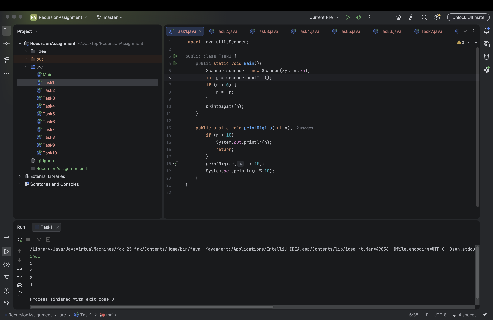
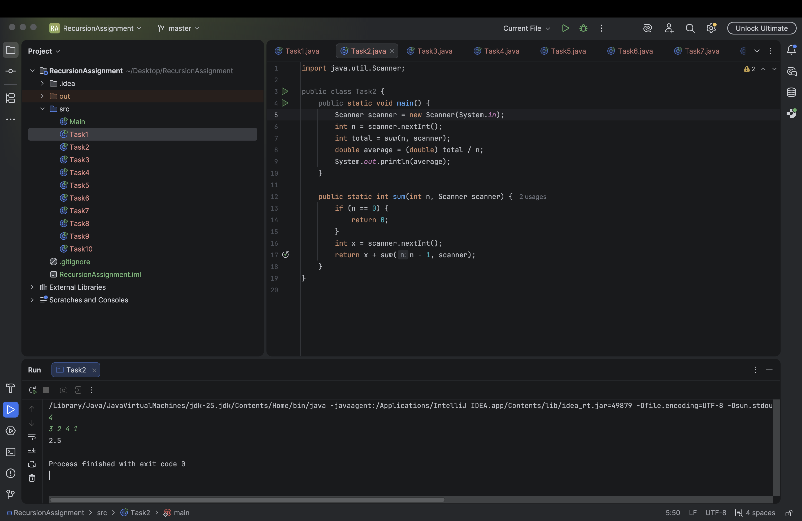
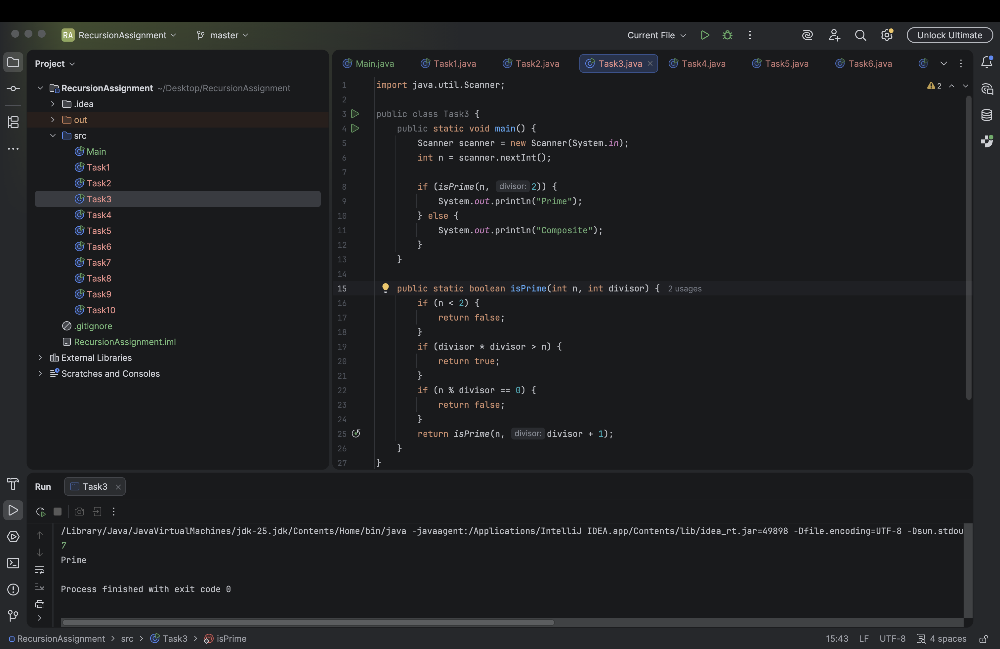
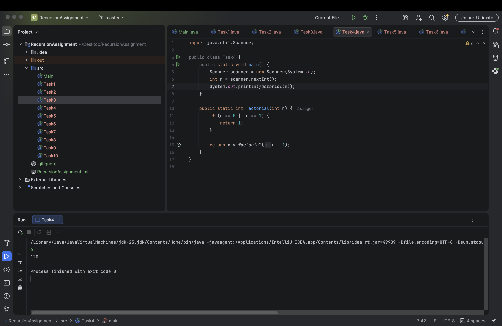
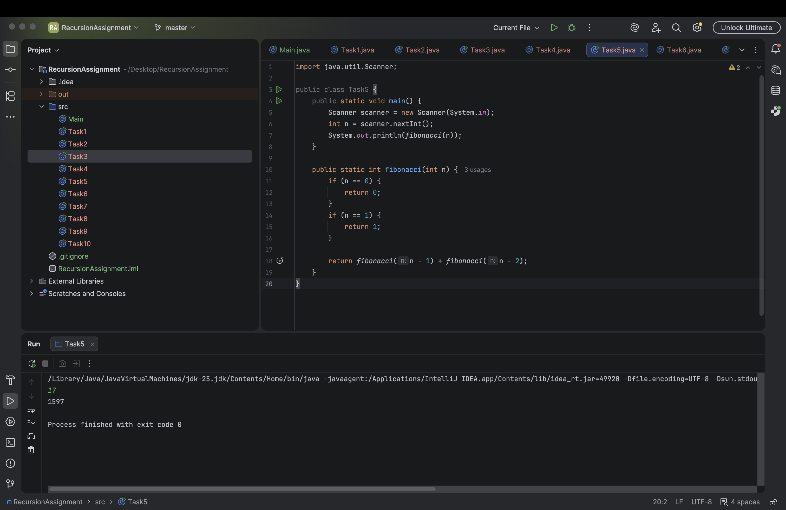
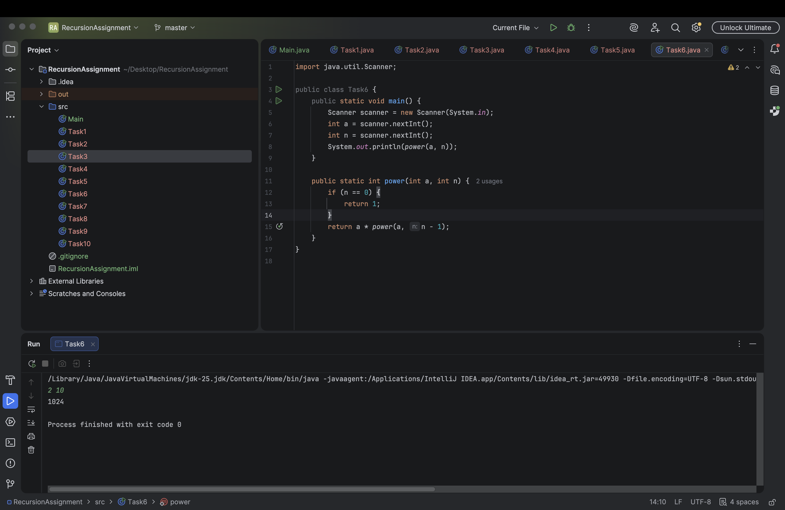
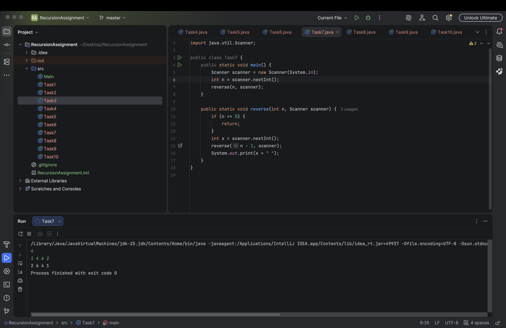
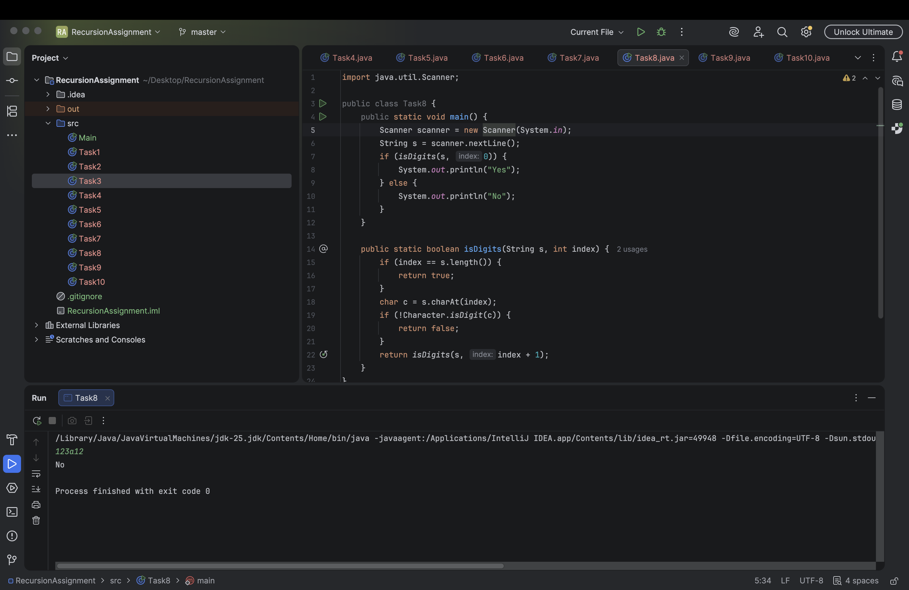
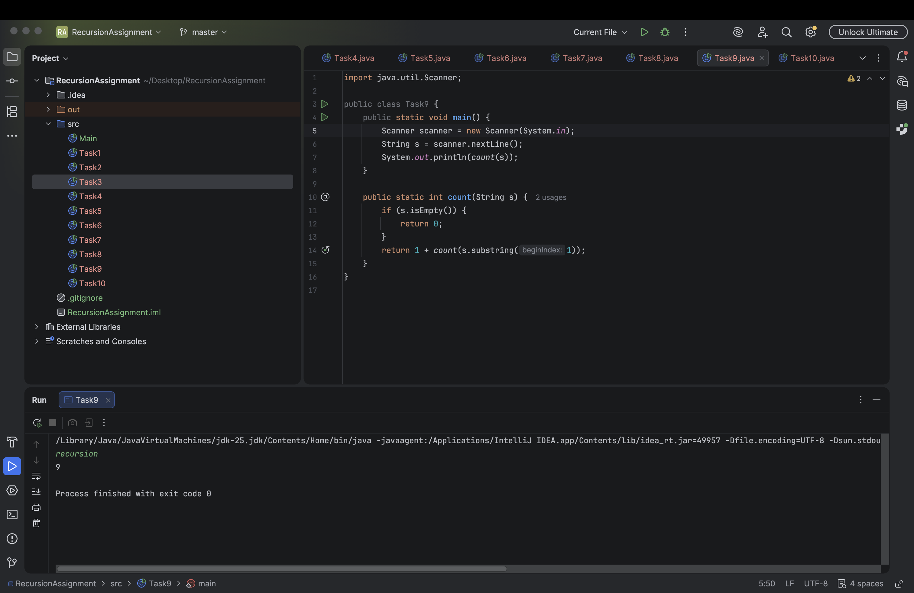
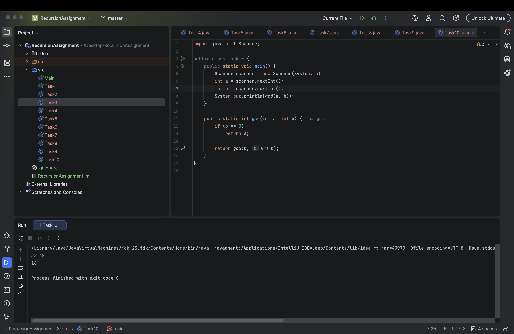

#Java recursion assignment

Name: Alibek Babassov

Group: IT-2503

Summary: This project contains 10 tasks solved using recursion only. No loops were used.

Task1
Print digits of a number using recursion.

Task2
Calculate average using recursive sum.

Task3
Check if a number is prime using recursion.

Task4
Calculate factorial using recursion.

Task5
Find Fibonacci number using recursion.

Task6
Calculate power a^n using recursion.

Task7
Print numbers in reverse using recursion.

Task8
Check if string contains only digits.

Task9
Count characters in a string using recursion.

Task10
Find GCD using Euclidean algorithm.

